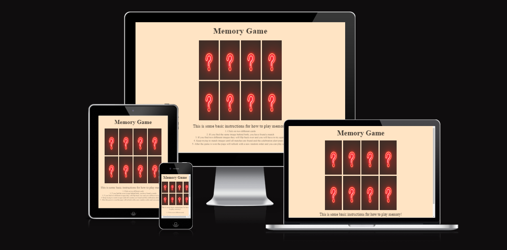
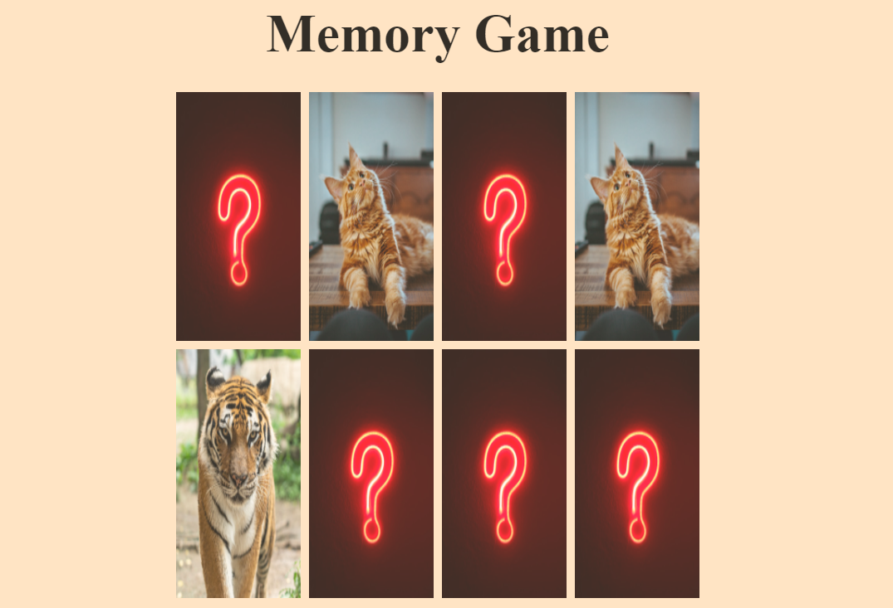
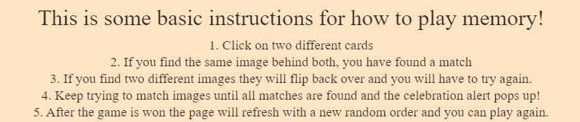
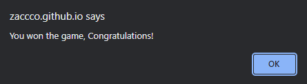
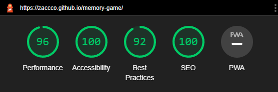

# Memory Game

The purpose of this website was for me to learn how to incorporate JavaScript into a website. With this I created a memory game that is not very advanced but still has all the features you would need in order for the game to work as expected.

When the page is loaded the cards will be shuffled into a random order and thereafter the user will try and match the same two images by clicking on two cards and seeing if the same image is hidden behind them. Repeat this until all matches are found and a congratulations message will show and the page will reload with a new random order.

# Features

This project consists of only a single page where a user-friendly game of Memory is playable along with some basic instructions on how to play the game.

* Game area

    * At the center of the page you will find the 8 cards with a backface shown until you click to reveal what frontface image is set behind the backface. 
    * This is where the user will play the memory game

* Instructions

    * Below the game area, you will find some basic instructions on how to play memory in case you haven't played it before or are unsure on how it works.

* Congratulations message

    * After the game is won, an alert message congratulating the user will show and after "ok" is pressed, the page will reload and allow the user to play again.

# Future implementations

* If I was to take up this project in the future I would like to:
    * Create some form of a scoretracker or a tracker on how many guesses the user has taken.
    * A function that makes sure that a user can't click more than two cards before they are checked if they match or not. Currently if you're too fast you can click a third image before the function has calculated if the first two were a match or not. However, I don't think this is something a user would notice because of the short timeout set to flip back over two cards that doesn't match. So unless you were intentionally trying to break the game, I don't believe a user would notice this.
    * Increase the number of cards the game has. I didn't feel this was necessary for this project as it doesn't show my skill any more than having fewer cards. It would just take a longer time to gather the images and tweaking the code to make sure that it still randomizes depending on the number of cards.

# User Experience (UX)

### New user goals:
* User is able to play a fun game of memory
* It could also teach the rules and instructions of the game in case the user has never played a memory game before.

### Returning user goals:
* User would be able to replay the game since the game randomizes every time the user restarts, therefore you could play memory again with the same amount of fun as the first time.

# Surface

### Colors

Main colors used un this project:
* background-color: bisque;
* font color: black

### Fonts
* As a main font I used Lato, with a backup of sans-serif.

### Images
* All images found in this project were found on [Unsplash](https://unsplash.com/) and they are credited in the credits section.

# Technologies used

### HTML5
* As a structure language.
### CSS
* As a style language.
### JavaScript
* As a functionality language.
### GitHub
* As a software hosting platform to keep project in a remote location.
### Git
* As a version-control system tracking.
### Gitpod
* As a development hosting platform.

# Testing

* I used Chrome DevTools throughout the project to check that my CSS behaved as expected and also used it as a quicker way to change CSS before officially applying them. 

* I have tested that this page works on different browsers, Chrome, Firefox and Safari.

* I can confirm that the website is responsive and will look good on all standars screen sizes.

* I confirmed that all text, navigation, images etc. is easy to understand and easily readable.

* The game works as expected with a few minor bugs that I have mentioned in the bugs section and also in the future implementations section.

# Bugs

### Solved bugs
* I have encountered several bugs with this project:
    * I tried many times to figure out a way to randomize the order of the cards. I tried writing a function that changes the source attribute of the cards into a random image, however I didn't get that to work so instead I decided to target each card using an ID and then changing the order of each card between the number 1-8 using javaScript to change the order of each element.
    * There was a bug were the function I wrote on calculting when the game was won didn't work as expected. It turned out that I was using one "=" instead of three and when changed, it worked again as expected.

# Validator Testing

* HTML
    * No errors were found on either of the three pages when passing through the official W3C validator.
* CSS
    * No errors were found when passing through the official (Jigsaw) validator.
* JavaScript
    * No errors were found in JSHint JavaScript Validator.
* Accessibility
    * I confirmed that the colors and fonts chosen are easy to read and accessible by running it through lighthouse in devtools.

    ### Home page: 

    

# Unsolved bugs

*  If a user clicks quickly three of the cards in the memory game they will all be revealed because it takes 0.6 seconds for the game to check if the first two cards clicked were a match or not. So if you would click a third time within that timespan that third card would also be revealed and therefore break the game.
    * One way to solve this would be to make that third card unclickable by somehow locking the board after the first two clicks. This is something I tried to implement but was unsuccessful, but as mentioned in the Future Implementations section, I didn't think this was necessary as unless you intentionally tried to do this I don't believe a user would exploit this bug. I will have to solve this bug at a later time.
    * Another way to solve this would be to shorten the time it takes for the unmatched cards to flip back over, therefore give an even shorter time for the "third" card to be clicked. I don't think this would be a good solution as it doesn't give enough time for the user to see what images they just clicked on.

# Deployment

* This website was deployed to GitHub pages. The steps to deply are as follows:
    * In the GitHub repository, navigate top the Settings tab.
    * From the menu on the left, select "Pages".
    * From the source section drop-down menu, select the Main Branch.
    * Once the main branch has been selected, the page provided the link to the completed website.

The live link can be found here - [Memory Game](https://zaccco.github.io/memory-game/)

# Credits

* I used this [Youtube](https://www.youtube.com/watch?v=ZniVgo8U7ek&t=1484s) video by freeCodeCamp.org to figure out how to "flip" the cards using CSS.

* I also used this [W3 Schools](https://www.w3schools.com/jsref/met_win_settimeout.asp) article to help me set a timeout function to make sure that after the second card is pressed, it is being revealed for a second before flipping back over. Without this function, the second card was never flipped.

* For randomizing the order of the cards found in the memory game itself, I used the CSS style 'order'. I learned about the use of this feature on [Mozilla Developer](https://developer.mozilla.org/en-US/docs/Web/CSS/order)

# Media 

* All images used in this project was taken from [Unsplash](https://unsplash.com/).
    * [Question Mark](https://unsplash.com/photos/49uySSA678U)
    * [Dog](https://unsplash.com/photos/2l0CWTpcChI)
    * [Cat](https://unsplash.com/photos/75715CVEJhI)
    * [Bunny](https://unsplash.com/photos/302xfiIGOfE)
    * [Tiger](https://unsplash.com/photos/gRB4Euk4BYQ)

